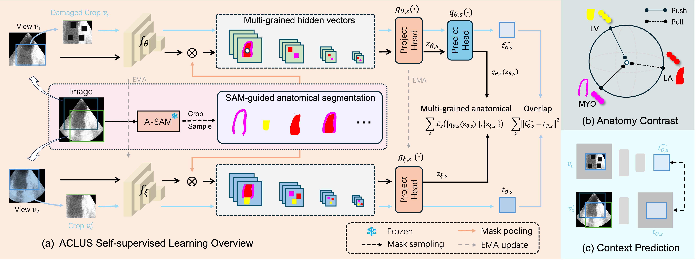

# ACLUS: A SAM-Guided Efficient Anatomy-Level Self-Supervised Pre-Training Method for Ultrasound Medical Image Analysis

## Abstract

**As artificial intelligence advances in the field of medical ultrasound image analysis, the need for effective pre-training methods to enhance diagnostic accuracy and efficiency becomes increasingly critical. Distinguished from existing ultrasound pre-training methods that are either region-based or focus solely on entire images or video frames, we propose Anatomy-level Contrastive Learning for Ultrasound Images (ACLUS), a simple yet effective approach specifically tailored to target the anatomical structures most critical in medical analysis. In our approach, we first integrate an auto prompter into the Segment Anything Model (SAM) to achieve ultrasound image segmentation without manual intervention by leveraging existing Image-Mask pairs for fine-tuning. Subsequently, ACLUS employs the auto-prompting capability to perform segmentation and conducts cross-view contrastive learning on anatomical structures. This enables the model to focus on anatomy-level invariant representations, effectively distinguishing different target structures, thereby improving the robustness of the learned representations. To achieve fine-grained representation learning, we incorporate anatomy-level regional contrast across different scales between multiple layers of the backbone, ensuring better capture of anatomical details. We conducted extensive experiments on ultrasound medical datasets across various downstream tasks. The experimental results demonstrated that the ACLUS method enhanced the quality of pre-training in the ultrasound domain and outperformed existing state-of-the-art methods.**


## 🔨 PostScript

😄 This project is the pytorch implemention of ACLUS

😆 Our experimental platform is configured with two *RTX3090* GPUs

## 💻 Installation

1. Clone or download this repository.

    ```
   cd <ACLUS_project_dir>
   ```

2. Create conda environment.
    ```
   conda create -n ACLUS python=3.9
   conda activatee ACLUS
   ```
3. Install dependencies.
    ```
   pip install -r requirements.txt
   ```

## 🐾 ACLUS Evaluation

1. Download our pre-trained ACLUS weights [pre-trained-aclus.pth](https://drive.google.com/file/d/1n8A3vK2UGE7g_7keC_NBfAa1HuKHp-Pz/view?usp=sharing)  

2. Download the 5 fold cross validation [POCUS](https://drive.google.com/file/d/1w7FrwqQ09VjwtTcZL5M0hZnW3Oly9Buv/view?usp=drive_link) dataset.

3. Run the demo with:

   ```
   python ./evaluation_aclus.py --data_path <pocus_data_path> --ckpt_path <pre_trained_aclus_path>
   ```

## 📘 Finetune SAM on US30K

### Checkpoint
Download checkpoint for SAM (Segment Anything Model): [ViT_b](https://dl.fbaipublicfiles.com/segment_anything/sam_vit_b_01ec64.pth)
### Dataset
1. Download US30k dataset, including [TN3K]( https://github.com/haifangong/TRFE-Net-for-thyroid-nodule-segmentation), [DDTI]( https://github.com/haifangong/TRFE-Net-for-thyroid-nodule-segmentation), [TG3K](https://github.com/haifangong/TRFE-Net-for-thyroid-nodule-segmentation), [BUSI](https://scholar.cu.edu.eg/?q=afahmy/pages/dataset), [UDIAT](http://www2.docm.mmu.ac.uk/STAFF/M.Yap/dataset.php), [CAMUS](http://camus.creatis.insa-lyon.fr/challenge/), and [HMC-QU](https://aistudio.baidu.com/aistudio/datasetdetail/102406), and convert these datasets into `.png` format.
2. Then these datasets should be set in the format of `./SAM/dataset/US30K` folder.
   ```none
   US30K
   ├── Brest-BUSI
   │   ├── img
   │   │   ├── xxx.png
   │   │   ├── ... 
   │   ├── lable
   │   │   ├── xxx.png
   │   │   ├── ...
   │── Echocardiography-CAMUS
   │   ├── img
   │   │   ├── xxx.png
   │   │   ├── ... 
   │   ├── lable
   │   │   ├── xxx.png
   │   │   ├── ...
   .........
   │── MainPatient
   ```
3. The `./SAM/MainPatient` folder contains the train/val.txt which has formatted line as:
   ```
     <class ID>/<dataset file folder name>/<image file name>
   ```
4. Set other configs in `./SAM/utils/config.py`.

### Finetune 

1. Finetune the SAM for the ultrasound domain with：
   ```
   python ./SAM/only_train_sam.py --sam_ckpt <sam_vit_b.pth> 
   ```
2. Finetune auto prompter with：
   ```
   python ./SAM/train_auto_prompter.py --sam_ckpt <finetuned_sam.pth> --load_auto_prompter
   ```

## 🐾 ACLUS Pre-training

1. Download dataset from [Butterfly](https://drive.google.com/file/d/1zefZInevopumI-VdX6r7Bj-6pj_WILrr/view?usp=sharing) and [CAMUS](http://camus.creatis.insa-lyon.fr/challenge/), and put them in the formatted directory as below:
   ```
   dataset
   ├── train
   │   ├──Butterfly
   │   │   ├──img
   │   │   ├──label
   │   ├──CAMUS
   │   │   ├──img
   │   │   ├──label
   ```
2. Run the `./utils/generate_masks_pkls.py` to generate masks .pkl files in './dataset/masks' 
   and indexes at `./dataset/train_tf_img_to_gt.pkl`.
   ```
   dataset
   ├── train
   │   ├──Butterfly
   │   │   ├──img
   │   │   ├──label
   │   ├──CAMUS
   │   │   ├──img
   │   │   ├──label
   │── masks
   │   ├──xxx.pkl
   │── train_tf_img_to_gt.pkl
   ```
3. Set training options in config file: `./configs/example.yaml`, and the `resume_path` is need to be assigned 
to the checkpoint file you want to resume training. 

4. Train the ACLUS model with:
   ```
   python -m torch.distributed.launch --nproc_per_node 2 --master_port 12345 pretrain_aclus.py --cfg ./configs/example.yaml
   ```
